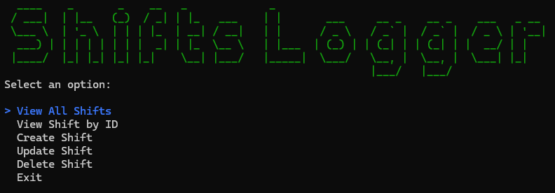
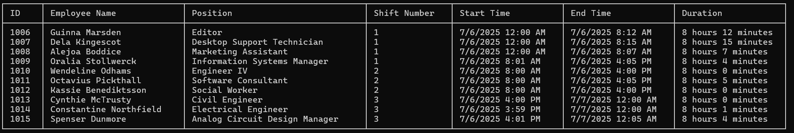
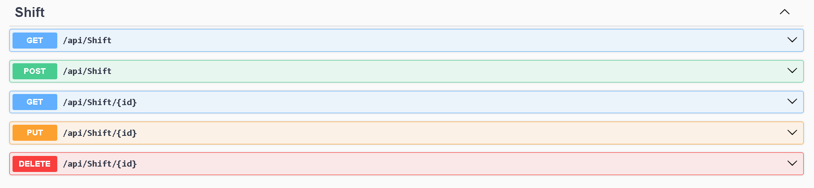

# Shifts Logger App

A web application for logging and managing work shifts. Built with ASP.NET, it features a RESTful API for database interactions and a user-friendly UI that consumes the API.



## Features

- Log, update, and delete work shifts
- View shift history and details
- RESTful API for CRUD operations
- Responsive UI for easy shift management



## Getting Started

### Prerequisites

- [.NET SDK](https://dotnet.microsoft.com/download)
- SQL Server or compatible database

### Setup

1. **Clone the repository:**

   ```bash
   git clone https://github.com/andymartinez1/Shifts-Logger-App.git
   cd Shifts-Logger-App
   ```

2. **Configure the database connection** in `appsettings.json`. Or create a database in SQL server named `shifts_db`
3. **First move to the API directory**

   ```bash
   cd Shifts-Logger-API
   ```

4. **Apply migrations:**

   ```bash
   dotnet ef database update
   ```

5. **Run the application:**

   ```bash
   dotnet run
   ```

6. **Access the UI:**  
   Navigate to `http://localhost:5267`

7. **Move to the UI**

   ```bash
   cd ..
   cd Shifts-Logger-UI
   ```

8. **Run the application:**

   ```bash
   dotnet run
   ```

9. **To test in Swagger, use the following URL:**

   ```bash
   http://localhost:5267/swagger
   ```



10. **To test in Postman, use the shared collection in the project root directory.**

## API Endpoints

| Method | Endpoint         | Description        |
| ------ | ---------------- | ------------------ |
| GET    | /api/shift       | List all shifts    |
| POST   | /api/shift       | Create a new shift |
| PUT    | /api/shift /{id} | Update a shift     |
| DELETE | /api/shift /{id} | Delete a shift     |

## UI Usage

- **View Shifts:**: See all logged shifts in a table.
- **View Shift by ID**: See detailed information of each shift
- **Create Shift:**: Use the form to log a new shift.
- **Update/Delete:**: Manage existing shifts directly from the UI.

## Technologies Used

- C#
- Entity Framework
- SQL Server
- Spectre Console
